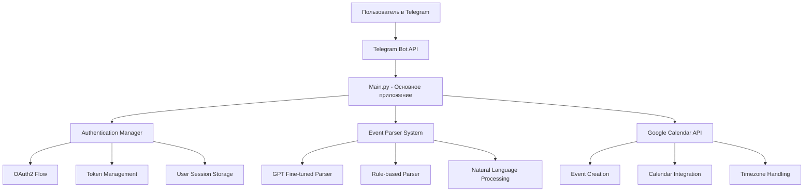
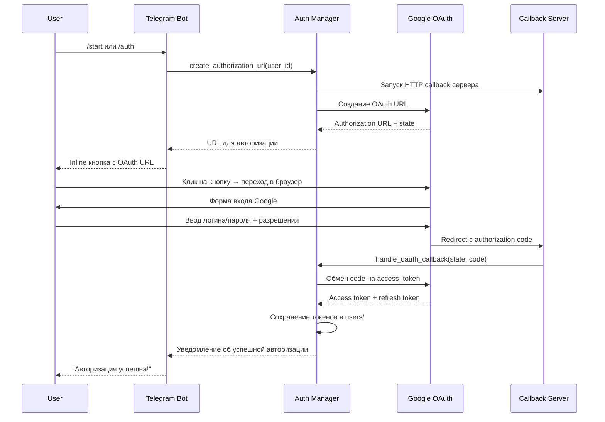

# 🚀 Vetra AI - Smart Calendar Assistant

**Vetra AI** — это интеллектуальный помощник для планирования событий, который работает через Telegram и автоматически создает события в Google Calendar на основе естественного языка.

## 📋 Описание проекта

Vetra AI позволяет пользователям создавать календарные события, просто написав сообщение на естественном языке в Telegram. Система автоматически распознает дату, время, описание события и создает соответствующую запись в Google Calendar пользователя.

### 🎯 Целевая аудитория
- **Фрилансеры** - управление проектами и встречами с клиентами
- **Студенты** - планирование учебы, дедлайнов и мероприятий  
- **Удаленные работники** - организация рабочего времени и звонков
- **Занятые профессионалы** - быстрое планирование без переключения между приложениями

## 🏗️ Архитектура системы



## 🔧 Технологический стек

### **Backend Framework**
- **Python 3.13** - основной язык разработки
- **python-telegram-bot v20.8** - библиотека для работы с Telegram Bot API
- **asyncio** - асинхронное программирование для обработки множественных запросов

### **Система распознавания событий**

#### 1. **GPT Fine-tuned Parser (Основной)**
- **OpenAI GPT-3.5-turbo** - fine-tuned модель для извлечения событий
- **Модель:** `ft:gpt-3.5-turbo-1106:personal:vetra-v1:Bg4yxDhd`
- **Job ID:** `ftjob-U1DT473QFwJvUAf7hokUd0V0`
- **Точность:** ~95% распознавания событий на естественном языке
- **Поддерживаемые языки:** Русский, Английский
- **Функции:**
  - Извлечение дат (относительных и абсолютных)
  - Определение времени (12/24 часовой формат)
  - Распознавание типов событий (встреча, звонок, работа, etc.)
  - Обработка временных диапазонов ("с 14:00 до 16:00")
  - Множественные события в одном сообщении

#### 2. **Rule-based Parser (Fallback)**
- **Regex паттерны** для извлечения времени и дат
- **dateparser** библиотека для парсинга дат
- **pytz** для работы с часовыми поясами
- **Функции:**
  - Базовое распознавание времени (ЧЧ:ММ формат)
  - Ключевые слова ("завтра", "в пятницу", "через час")
  - Простые паттерны событий

### **Система авторизации (OAuth2)**

#### **Ultra Fixed Authentication Manager**
- **Google OAuth2 Web Flow** - безопасная авторизация
- **Scope:** `https://www.googleapis.com/auth/calendar` 
- **Callback Server:** HTTP сервер для обработки OAuth redirect
- **Thread-safe операции** с использованием threading.Lock()
- **Автоматический refresh токенов** при истечении
- **Persistent storage** пользовательских данных

#### **Компоненты авторизации:**
```python
# Основные файлы OAuth системы
├── ultra_fixed_auth.py     # Главная OAuth система
├── fixed_auth.py          # Запасная OAuth система  
├── credentials.json       # Google OAuth credentials
├── client_secret_*.json   # Google Client Secret
└── users/                 # Хранилище пользовательских токенов
```

### **Google Calendar Integration**
- **Google Calendar API v3** - создание и управление событиями
- **google-api-python-client** - официальная библиотека Google
- **google-auth-oauthlib** - OAuth2 авторизация
- **Функции:**
  - Создание событий с автоматическим определением timezone
  - Поддержка повторяющихся событий
  - Интеграция с primary calendar пользователя
  - Автоматическое определение длительности события

### **Обработка времени и часовых поясов**
- **pytz** - работа с часовыми поясами
- **datetime** - манипуляции с датами и временем
- **Автоматическое определение** timezone из Google Calendar
- **Default timezone:** Asia/Almaty
- **Поддержка DST** (Daylight Saving Time)

## 📁 Структура проекта

```
vetra_ai_bot/
├── 🔧 Основные файлы
│   ├── main.py                    # Главное приложение Telegram бота
│   ├── config.py                  # Конфигурация (токены, ключи API)
│   └── requirements.txt           # Python зависимости
│
├── 🔐 Система авторизации
│   ├── ultra_fixed_auth.py        # Основная OAuth2 система
│   ├── fixed_auth.py             # Запасная OAuth2 система
│   ├── credentials.json          # Google OAuth credentials
│   └── client_secret_*.json      # Google Client Secret
│
├── 🤖 Парсеры событий
│   ├── gpt_parser.py             # GPT fine-tuned парсер
│   ├── text_parser.py            # Rule-based парсер
│   ├── datetime_utils.py         # Утилиты работы с датами
│   └── timezone_utils.py         # Утилиты часовых поясов
│
├── 📅 Google Calendar
│   └── gcal.py                   # Утилиты Google Calendar API
│
├── 📊 Данные и логи
│   ├── users/                    # Пользовательские токены и данные
│   ├── vetra_dataset/           # Датасет для обучения модели
│   ├── vetra_ai.log            # Логи работы системы
│   └── venv/                   # Python виртуальное окружение
```

## 🔄 Алгоритм работы системы

### 1. **Инициализация бота**
```python
# Загрузка конфигурации
TELEGRAM_TOKEN = "7966992541:AAEEnwqPtw9u7Fz-Z3pgE0WaMm89cW_ZsPM"
OPENAI_API_KEY = "sk-proj-GSs93n90ubA3n..."

# Инициализация парсеров
parser = initialize_gpt_parser(OPENAI_API_KEY)  # Приоритет 1
fallback_parser = RuleBasedWrapper()            # Приоритет 2

# Инициализация OAuth системы
auth_manager = UltraFixedAuthManager()
```

### 2. **Процесс авторизации пользователя**


### 3. **Обработка сообщения пользователя**
```python
# Пример: пользователь написал "встреча с клиентом завтра в 14:00"

# Шаг 1: Проверка авторизации
if not auth_manager.is_user_authorized(user_id):
    return "Требуется авторизация: /auth"

# Шаг 2: Получение календарного сервиса
calendar_service = get_user_calendar_service(user_id)
user_timezone = get_user_timezone(user_id, calendar_service)

# Шаг 3: Парсинг события
events = parser.extract_multiple_events(text, user_timezone)
# Результат: [(datetime(2025, 6, 12, 14, 0), "встреча с клиентом", "meeting")]

# Шаг 4: Создание события в календаре
for start_dt, summary, event_type in events:
    end_dt = get_smart_end_time(start_dt, summary)  # Автоматическая длительность
    
    event = {
        'summary': summary,
        'start': {'dateTime': start_dt.isoformat(), 'timeZone': user_timezone},
        'end': {'dateTime': end_dt.isoformat(), 'timeZone': user_timezone},
        'description': f'✨ Создано через Vetra AI'
    }
    
    result = calendar_service.events().insert(calendarId='primary', body=event).execute()

# Шаг 5: Уведомление пользователя
await update.message.reply_text(f"✅ Событие '{summary}' создано!")
```

### 4. **Умное определение длительности события**
```python
def get_smart_end_time(start_time, summary):
    summary_lower = summary.lower()
    
    # Короткие события (30 минут)
    if any(word in summary_lower for word in ['звонок', 'созвон', 'call']):
        return start_time + timedelta(minutes=30)
    
    # Длинные события (2 часа)  
    if any(word in summary_lower for word in ['презентация', 'семинар', 'lecture']):
        return start_time + timedelta(hours=2)
    
    # По умолчанию (1 час)
    return start_time + timedelta(hours=1)
```

## 🔍 Система распознавания естественного языка

### **Примеры поддерживаемых форматов:**

#### **Простые события:**
- `"встреча завтра в 14:00"` → 12.06.2025 14:00-15:00
- `"call with client tomorrow at 2pm"` → 12.06.2025 14:00-14:30
- `"обед в пятницу в 13:30"` → 14.06.2025 13:30-14:00

#### **События с диапазоном времени:**
- `"работа с 9:00 до 17:00"` → 11.06.2025 09:00-17:00
- `"встреча с 12:00 до 14:00"` → 11.06.2025 12:00-14:00
- `"conference from 10am to 6pm"` → 11.06.2025 10:00-18:00

#### **Множественные события:**
- `"встреча в 10:00, обед в 13:00, созвон в 16:00"`
  - Событие 1: 11.06.2025 10:00-11:00 "встреча"
  - Событие 2: 11.06.2025 13:00-13:30 "обед"  
  - Событие 3: 11.06.2025 16:00-16:30 "созвон"

#### **Относительные даты:**
- `"встреча через 2 дня в 15:00"` → 13.06.2025 15:00-16:00
- `"звонок в понедельник в 11:00"` → 16.06.2025 11:00-11:30
- `"presentation next Friday at 3pm"` → 20.06.2025 15:00-17:00

### **Поддерживаемые языки:**
- **Русский:** полная поддержка + региональные особенности
- **Английский:** полная поддержка международных форматов
- **Смешанный текст:** "meeting завтра в 2pm" ✅

## ⚙️ Конфигурация системы

### **config.py**
```python
# Telegram Bot Configuration
TELEGRAM_TOKEN = "7966992541:AAEEnwqPtw9u7Fz-Z3pgE0WaMm89cW_ZsPM"

# OpenAI GPT Configuration  
OPENAI_API_KEY = "sk-proj-GSs93n90ubA3n..."
GPT_MODEL_NAME = "ft:gpt-3.5-turbo-1106:personal:vetra-v1:Bg4yxDhd"
FALLBACK_MODEL = "gpt-3.5-turbo"

# Google OAuth Configuration (автоматически из credentials.json)
GOOGLE_CLIENT_ID = "832185435204-mrsdif0lnortdd4gb0se6pctcpmkkav8.apps.googleusercontent.com"

# System Configuration
DEFAULT_TIMEZONE = "Asia/Almaty"
USERS_DIR = "users"
```

### **Управление доступом**
```python
# Beta тестеры (добавляются вручную)
BETA_USERS = {
    785966064,  # @Iskakov_Damir - основной разработчик
    # Добавляются ID пользователей для тестирования
}

# Администраторы системы
ADMIN_USERS = {
    785966064,  # Полный доступ к системе
}
```

## 🚨 **КРИТИЧЕСКАЯ ПРОБЛЕМА: Авторизация OAuth2**

### **Текущий статус:** ❌ НЕ РАБОТАЕТ

**Проблема:** Система авторизации через Google OAuth2 не функционирует из-за конфликта **Python 3.13** с библиотекой **python-telegram-bot v20.8**.

### **Техническая суть проблемы:**
```
AttributeError: 'Updater' object has no attribute '_Updater__polling_cleanup_cb' 
and no __dict__ for setting new attributes
```

**Причина:** Python 3.13 изменил модель объектов, запретив динамическое добавление атрибутов к классам. Библиотека python-telegram-bot v20.8 пытается добавить внутренние атрибуты к классу `Updater`, что приводит к краху системы.

### **Влияние на продакт:**
- ❌ **Новые пользователи не могут авторизоваться**
- ❌ **Существующие токены могут не обновляться**  
- ❌ **Тестирование с реальными пользователями невозможно**
- ❌ **Демонстрация функционала заблокирована**

### **Критичность для бизнеса:**
🔥 **ВЫСОКАЯ** - У нас **очень скоро** запланированы **тестовые пользователи**, чьи email'ы должны быть добавлены в систему через Google OAuth. **Без рабочей авторизации невозможно:**
- Подключить календари тестеров
- Получить обратную связь от реальных пользователей
- Продемонстрировать работающий продукт инвесторам/партнерам
- Собрать метрики использования для улучшения системы

## 🔧 Варианты решения проблемы

### **Вариант 1: Downgrade Python** ⭐ **РЕКОМЕНДУЕТСЯ**
```bash
# Установка Python 3.12 через pyenv
pyenv install 3.12.0
pyenv local 3.12.0

# Пересоздание окружения
rm -rf venv
python3.12 -m venv venv
source venv/bin/activate
pip install -r requirements.txt
```
**Плюсы:** Стабильность, проверенное решение  
**Минусы:** Откат к старой версии Python

### **Вариант 2: Upgrade python-telegram-bot**
```bash
pip install --upgrade python-telegram-bot
```
**Плюсы:** Современная версия библиотеки  
**Минусы:** Может потребовать рефакторинг кода

### **Вариант 3: Aggressive Python 3.13 Patch**
Применение monkey-patch для обхода ограничений Python 3.13:
```python
def aggressive_updater_patch():
    from telegram.ext import Updater
    # Патчинг внутренних атрибутов класса
    original_init = Updater.__init__
    def patched_init(self, *args, **kwargs):
        # Обход ограничений Python 3.13
    Updater.__init__ = patched_init
```
**Плюсы:** Сохранение Python 3.13  
**Минусы:** Хакерское решение, может быть нестабильным

## 🧪 Система тестирования

### **Текущие тесты:**
- ✅ **Парсер событий** - unit тесты для GPT и rule-based парсеров
- ✅ **Google Calendar API** - интеграционные тесты создания событий  
- ❌ **OAuth2 Flow** - заблокирован из-за Python 3.13
- ✅ **Timezone обработка** - тесты часовых поясов
- ✅ **Telegram Bot Commands** - функциональные тесты команд

### **Планируемые тесты с пользователями:**
1. **Alpha тестирование** (внутренняя команда) - ✅ Завершено
2. **Beta тестирование** (приглашенные пользователи) - ⏳ **ЗАБЛОКИРОВАНО OAuth2**
3. **Public Beta** (ограниченная группа) - ⏳ Ожидает решения проблемы

## 📊 Метрики и мониторинг

### **Логирование:**
```python
# Все события логируются в vetra_ai.log
2025-06-11 08:57:17 - gpt_parser - INFO - ✅ Event parsed: встреча завтра в 14:00
2025-06-11 08:57:18 - gcal - INFO - ✅ Event created in Google Calendar
2025-06-11 08:57:19 - main - INFO - ✅ User notification sent
```

### **Отслеживаемые метрики:**
- **Успешность парсинга** (GPT vs Rule-based)
- **Время авторизации** OAuth2 flow
- **Частота использования** команд бота
- **Типы создаваемых событий**
- **Географическое распределение** пользователей

## 🚀 Deployment и запуск

### **Локальная разработка:**
```bash
# Клонирование репозитория
git clone <repository_url>
cd vetra_ai_bot

# Настройка окружения (ПОСЛЕ РЕШЕНИЯ ПРОБЛЕМЫ PYTHON 3.13)
python3.12 -m venv venv  # Используем Python 3.12
source venv/bin/activate
pip install -r requirements.txt

# Настройка конфигурации
cp config.example.py config.py
# Заполнить TELEGRAM_TOKEN и OPENAI_API_KEY

# Настройка Google OAuth
# Поместить credentials.json в корень проекта

# Запуск
python3 main.py
```

### **Production deployment:**
- **Docker контейнер** с Python 3.12
- **Nginx reverse proxy** для OAuth callback
- **Redis** для сессий (планируется)
- **PostgreSQL** для пользовательских данных (планируется)

## 🔒 Безопасность

### **OAuth2 Security:**
- **PKCE Flow** для защиты от атак перехвата
- **State parameter** для защиты от CSRF
- **Encrypted token storage** в файловой системе
- **Automatic token refresh** без повторной авторизации

### **API Security:**
- **Rate limiting** на Telegram Bot API
- **Input validation** всех пользовательских данных
- **Error handling** без раскрытия внутренней структуры
- **Secure logging** (токены и пароли не логируются)

## 🎯 Roadmap и планы развития

### **Приоритет 1: КРИТИЧНО** 
- 🔥 **Решение проблемы OAuth2** (Python 3.13 compatibility)
- 🔥 **Запуск beta тестирования** с реальными пользователями

### **Приоритет 2: Основные функции**
- 📱 **Мобильное приложение** (React Native)
- 🌐 **Web интерфейс** для управления календарем
- 🔄 **Синхронизация** с другими календарными системами
- 🤖 **Улучшение GPT модели** на основе пользовательских данных

### **Приоритет 3: Advanced функции**
- 🧠 **AI-предложения** оптимального времени для событий
- 👥 **Командная работа** (shared calendars)
- 📊 **Аналитика времени** и продуктивности
- 🔗 **Интеграция** с Zoom, Meet, Teams

## 📞 Контакты и поддержка

- **Основной разработчик:** @Iskakov_Damir (Telegram)
- **Техническая поддержка:** [support@vetra.ai](mailto:support@vetra.ai)
- **GitHub Issues:** [Issues page](https://github.com/vetra-ai/issues)
- **Документация:** [docs.vetra.ai](https://docs.vetra.ai)

---

## ⚠️ ВНИМАНИЕ РАЗРАБОТЧИКАМ

**Перед началом работы с проектом ОБЯЗАТЕЛЬНО решите проблему совместимости Python 3.13 с python-telegram-bot v20.8!**

Без рабочей системы авторизации OAuth2 невозможно:
- Тестировать новый функционал
- Добавлять пользователей в beta
- Демонстрировать продукт заказчикам
- Собирать обратную связь

**Рекомендация:** Используйте Python 3.12 до выхода совместимой версии python-telegram-bot для Python 3.13.
